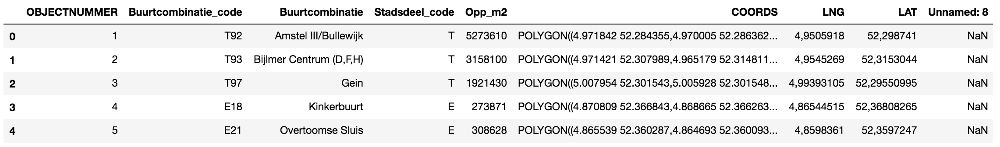
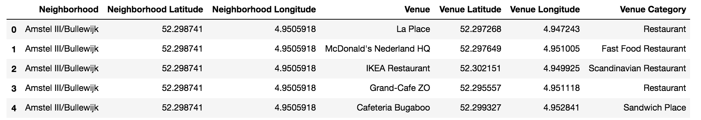

### Introduction
- The client would like to open a new Italian restaurant in Amsterdam (The Netherlands) and would like to know what is the best place in the city to open one, based on the other restaurants that are nearby.
- The target audience are entrepreneur in the food and services industry that want to open their first venue or expand their existing chain.
The approach of this study can be easily applied to other cities or other categories of restaurants.
- This is important because the location of a restaurant can affect in a significant way its profitability.

### Data

In order to solve the problem I will use the following data:

1) The city of Amsterdam provides a list of Amsterdam Quarters with geospatial coordinates. https://maps.amsterdam.nl/open_geodata/
I will use that to segment the city in quarters for the analysis in order to find the most suitable quarter where to open the new venue.
Of the dataset provided I am interested in the following features: Name of the Quarter (Buurtcombinatie), Longitude (LNG), Latitude (LAT). Example of the data:

2) The Foursquare API Get Venue Recommendations to get the data of the venues that are in each quarter. I will use the section parameter to restrict the results to only food venues. Example of the data:

### Methodology
TDB

### Results
TBD

### Discussion
TBD

### Conclusion
TBD
