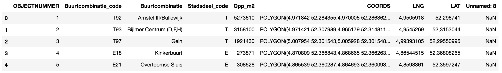
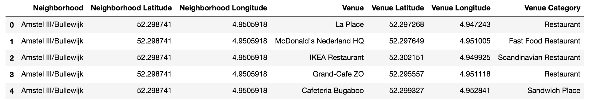

# Applied Data Science Capstone Project on Coursera
## The Battle of Neighborhoods: Where to open a new Italian Restaurant in Amsterdam?
### Author: Francesco Chiossi

## Introduction
- The client would like to open a new Italian restaurant in Amsterdam (The Netherlands) and would like to know what is the best place in the city to open one, based on the other restaurants that are nearby.
- The target audience are entrepreneur in the food and services industry that want to open their first venue or expand their existing chain.
The approach of this study can be easily applied to other cities or other categories of restaurants.
- This is important because the location of a restaurant can affect in a significant way its profitability.

## Data

In order to solve the problem I will use the following data:

1) The city of Amsterdam provides a list of Amsterdam Quarters with geospatial coordinates. https://maps.amsterdam.nl/open_geodata/
I will use that to segment the city in quarters for the analysis in order to find the most suitable quarter where to open the new venue.
Of the dataset provided I am interested in the following features: Name of the Quarter (Buurtcombinatie), Longitude (LNG), Latitude (LAT). Example of the data:

2) The Foursquare API Get Venue Recommendations to get the data of the venues that are in each quarter. I will use the section parameter to restrict the results to only food venues. Example of the data:

## Methodology
1. I started by loading into a pandas data frame the open data provided by the city of Amsterdam with list of Quarters with geospatial coordinates. The data frame had 99 entries with the following columns:
`['OBJECTNUMMER', 'Buurtcombinatie_code', 'Buurtcombinatie','Stadsdeel_code', 'Opp_m2', 'COORDS', 'LNG', 'LAT', 'Unnamed: 8']`.

2. From the data set I extracted the 3 columns with the features I needed: Name of the Quarter (Buurtcombinatie), Longitude (LNG), Latitude (LAT). Longitude and Latitude where provided with the comma as decimal separator, so they were converted to use the dot.

3. Using the coordinates of the quarters from 2. I called the Foursquare API explore `https://api.foursquare.com/v2/venues/explore` to get the top 100 venues in a 500 meter range of the central point of the quarter. I also used the `section` parameter to limit the results to only food venues. The data was stored into a data frame with 2401 rows and 7 columns: `['Neighborhood', 'Neighborhood Latitude', 'Neighborhood Longitude', 'Venue', 'Venue Latitude', 'Venue Longitude', 'Venue Category']`

4. For each Quarter I counted the venues by type and calculate the most populars (by frequency). This will be used later for the analysis.

5. 

## Results
TBD

## Discussion
TBD

## Conclusion
TBD
